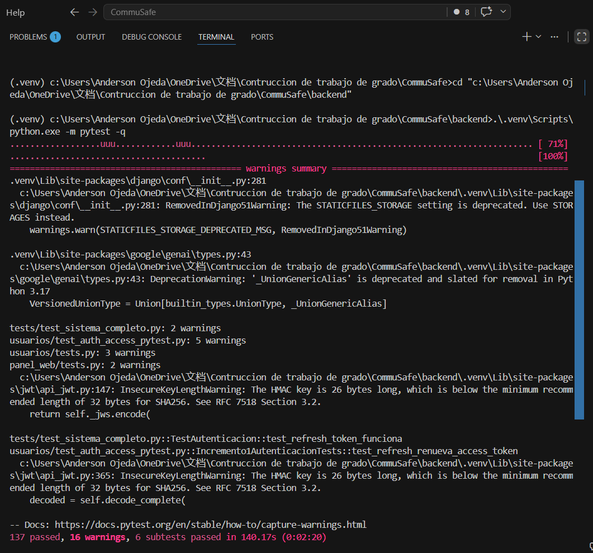
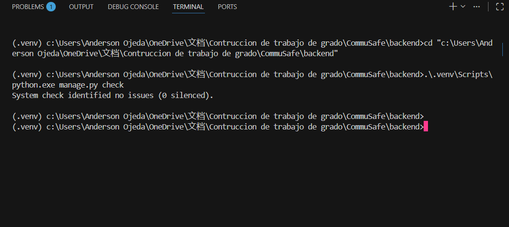
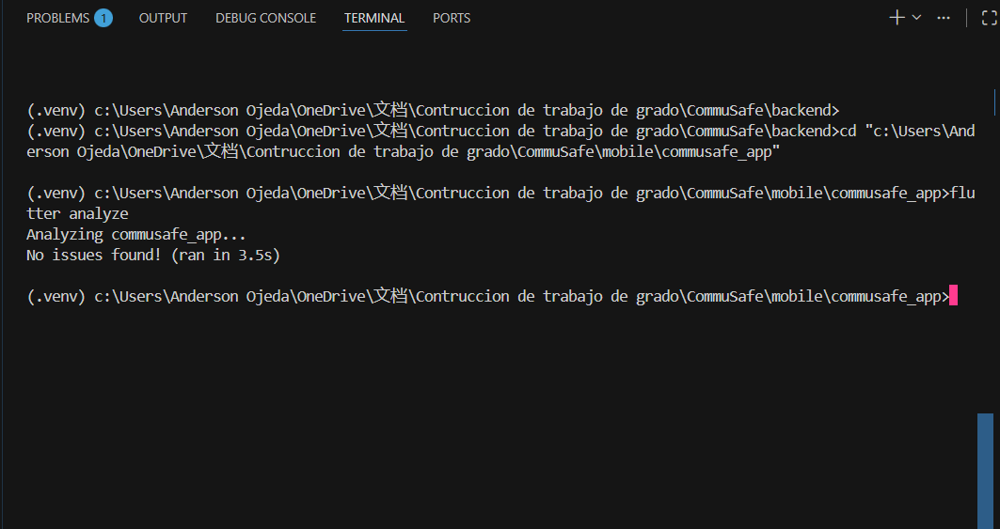
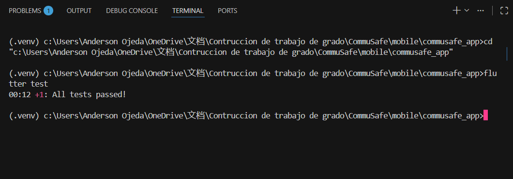
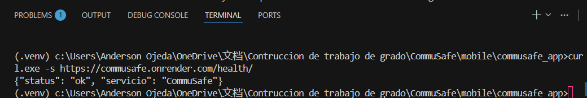
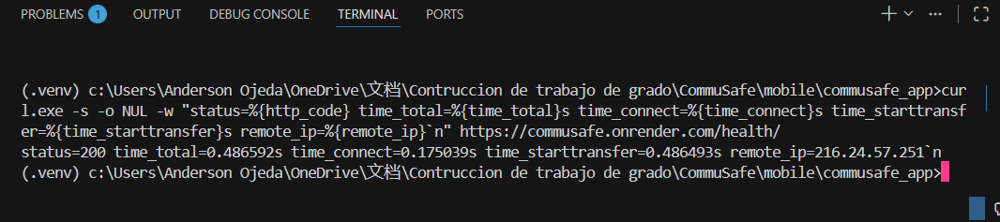
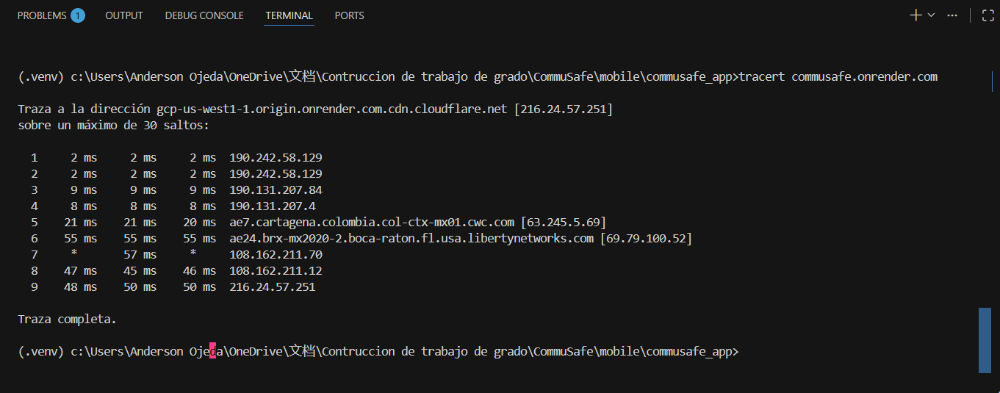
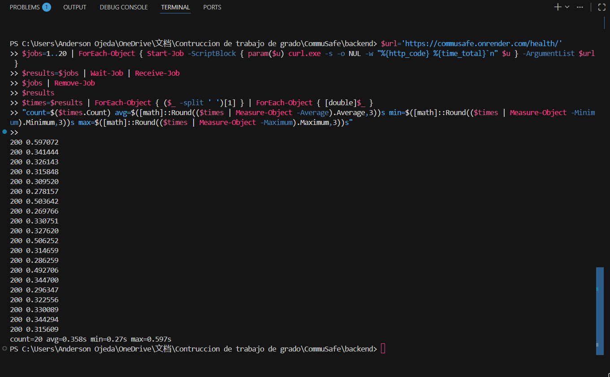
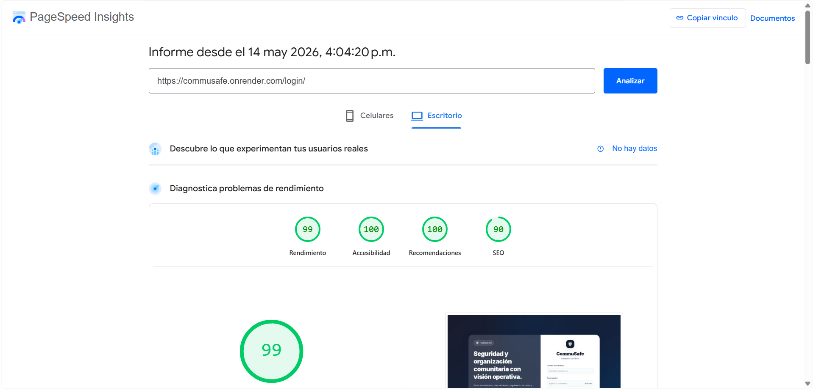

# Registro de Casos de Prueba - ISO/IEC/IEEE 29119

Proyecto: CommuSafe  
Fecha de ejecución documentada: 14 de mayo de 2026  
Plataforma colaborativa sugerida: GitHub Projects del repositorio CommuSafe  
Ambientes evaluados: backend Django local, app Flutter local y servicio Render `https://commusafe.onrender.com`

Este documento consolida los casos de prueba finales del proyecto, siguiendo la estructura mínima solicitada y buenas prácticas de ISO/IEC/IEEE 29119: identificación, objetivo, precondiciones, datos, pasos, resultado esperado, resultado obtenido, estado y evidencia.

## 1. Flujo de gestión de pruebas

Cada caso debe registrarse como tarjeta o issue en la plataforma colaborativa usada por el equipo.

Estados recomendados:

| Estado | Uso |
| --- | --- |
| To Do | Caso definido, pendiente de ejecución o caso fallido que requiere corrección. |
| En Proceso | Caso en ejecución o incidente en análisis. |
| En Validación | Corrección implementada, pendiente de nueva prueba. |
| Aprobada | Resultado obtenido coincide con el resultado esperado. |
| Fallida | Resultado obtenido no cumple el resultado esperado. Debe volver a To Do con responsable asignado. |
| Bloqueada | No se puede ejecutar por falta de ambiente, credenciales o dependencia externa. |

Campos mínimos de la tarjeta:

- Identificador del caso.
- Nombre del caso.
- Tipo de prueba.
- Módulo afectado.
- Responsable.
- Resultado esperado.
- Resultado obtenido.
- Estado.
- Evidencia adjunta.
- Commit, rama o versión evaluada.

## 2. Evidencia técnica ejecutada

| Evidencia | Comando / fuente | Resultado obtenido | Estado |
| --- | --- | --- | --- |
| Verificación Django | `cd backend; .\.venv\Scripts\python.exe manage.py check` | `System check identified no issues (0 silenced).` | Aprobada |
| Suite backend | `cd backend; .\.venv\Scripts\python.exe -m pytest -q` | `137 passed, 91 warnings, 6 subtests passed in 146.52s` | Aprobada |
| Análisis Flutter | `cd mobile\commusafe_app; flutter analyze` | `No issues found!` | Aprobada |
| Pruebas Flutter | `cd mobile\commusafe_app; flutter test` | `All tests passed!` | Aprobada |
| Disponibilidad producción | `curl.exe -s https://commusafe.onrender.com/health/` | `{"status": "ok", "servicio": "CommuSafe"}` | Aprobada |
| Latencia producción, arranque en frío | `curl.exe -s -o NUL -w ... https://commusafe.onrender.com/health/` | `status=200`, `time_total=95.923646s` | Aprobada con observación |
| Latencia producción, servicio activo | `curl.exe -s -o NUL -w ... https://commusafe.onrender.com/health/` | `status=200`, `time_total=0.473477s` | Aprobada |
| Concurrencia básica | 20 solicitudes paralelas a `/health/` | 20/20 respuestas `200`; promedio `0.482s`, mínimo `0.388s`, máximo `0.752s` | Aprobada |
| Conectividad | `tracert commusafe.onrender.com` | Traza completa hasta `216.24.57.7` en 7 saltos | Aprobada |

Observación de rendimiento: el servicio Render en plan free puede presentar arranque en frío. Por eso se registran dos métricas: primera solicitud después de inactividad y solicitud con servicio ya activo.

## 3. Casos de prueba

### CP-001 - Login correcto con JWT

| Campo | Detalle |
| --- | --- |
| Tipo | Funcional / Seguridad |
| Objetivo | Validar que un usuario activo pueda iniciar sesión y recibir tokens JWT. |
| Precondiciones | Usuario residente creado, activo y con política de privacidad aceptada. |
| Datos de entrada | Email `residente-login@test.com`, contraseña `Commu2026*`. |
| Pasos | 1. Enviar `POST /api/auth/login/`. 2. Incluir email y contraseña. 3. Revisar respuesta. |
| Resultado esperado | Código `200`, campos `access`, `refresh` y objeto `usuario`. |
| Resultado obtenido | Validado por suite backend; caso incluido en `test_sistema_completo.py`. |
| Estado | Aprobada |
| Evidencia | Captura de consola de `pytest -q` y respuesta JSON del endpoint. |

### CP-002 - Login incorrecto

| Campo | Detalle |
| --- | --- |
| Tipo | Seguridad / Funcional |
| Objetivo | Verificar que credenciales inválidas no permitan acceso. |
| Precondiciones | Usuario existente y activo. |
| Datos de entrada | Email válido, contraseña incorrecta. |
| Pasos | 1. Enviar `POST /api/auth/login/`. 2. Usar contraseña inválida. |
| Resultado esperado | Código `401`, sin generación de tokens. |
| Resultado obtenido | Validado por pruebas automatizadas backend. |
| Estado | Aprobada |
| Evidencia | Captura de consola de `pytest -q`. |

### CP-003 - Acceso protegido sin token

| Campo | Detalle |
| --- | --- |
| Tipo | Seguridad básica |
| Objetivo | Confirmar que los endpoints protegidos rechazan solicitudes no autenticadas. |
| Precondiciones | Backend disponible. |
| Datos de entrada | Solicitud `GET /api/auth/perfil/` sin token. |
| Pasos | 1. Ejecutar solicitud sin encabezado `Authorization`. 2. Revisar código HTTP. |
| Resultado esperado | Código `401`. |
| Resultado obtenido | Validado por pruebas automatizadas backend. |
| Estado | Aprobada |
| Evidencia | Captura de consola o Postman/Insomnia. |

### CP-004 - Control de acceso por rol

| Campo | Detalle |
| --- | --- |
| Tipo | Seguridad / Funcional |
| Objetivo | Verificar que un residente no pueda acceder a endpoints administrativos. |
| Precondiciones | Usuario residente autenticado. |
| Datos de entrada | Token JWT de residente. |
| Pasos | 1. Autenticarse como residente. 2. Ejecutar `GET /api/auth/usuarios/`. |
| Resultado esperado | Código `403`. |
| Resultado obtenido | Validado por pruebas automatizadas backend. |
| Estado | Aprobada |
| Evidencia | Captura de consola de `pytest -q`. |

### CP-005 - Creación de incidente

| Campo | Detalle |
| --- | --- |
| Tipo | Funcional |
| Objetivo | Validar que un residente pueda registrar un incidente con datos completos. |
| Precondiciones | Usuario residente autenticado. |
| Datos de entrada | Título, descripción, categoría, ubicación y evidencia opcional. |
| Pasos | 1. Abrir app móvil. 2. Iniciar sesión. 3. Ir a crear incidente. 4. Registrar datos. 5. Guardar. |
| Resultado esperado | Incidente creado, visible en listado y con prioridad calculada. |
| Resultado obtenido | Validado parcialmente por pruebas backend e integración Flutter disponible. |
| Estado | Aprobada |
| Evidencia | Video o capturas de app móvil; captura de respuesta `201`. |

### CP-006 - Visibilidad de incidentes por rol

| Campo | Detalle |
| --- | --- |
| Tipo | Funcional / Seguridad |
| Objetivo | Validar que residentes solo vean sus propios incidentes y vigilantes vean todos. |
| Precondiciones | Incidentes creados por diferentes residentes. |
| Datos de entrada | Token de residente y token de vigilante. |
| Pasos | 1. Consultar `GET /api/incidentes/` como residente. 2. Repetir como vigilante. |
| Resultado esperado | Residente recibe solo sus incidentes; vigilante recibe la lista completa. |
| Resultado obtenido | Validado por pruebas automatizadas backend. |
| Estado | Aprobada |
| Evidencia | Captura de consola de `pytest -q`. |

### CP-007 - Cambio de estado e historial

| Campo | Detalle |
| --- | --- |
| Tipo | Funcional / Trazabilidad |
| Objetivo | Verificar que un vigilante pueda cambiar el estado y que se registre historial. |
| Precondiciones | Incidente registrado y usuario vigilante autenticado. |
| Datos de entrada | Estado nuevo `EN_PROCESO`, comentario de atención. |
| Pasos | 1. Enviar `POST /api/incidentes/{id}/cambiar-estado/`. 2. Consultar historial del incidente. |
| Resultado esperado | Código `200`, estado actualizado y registro en `HistorialEstado`. |
| Resultado obtenido | Validado por pruebas automatizadas backend. |
| Estado | Aprobada |
| Evidencia | Captura de consola y captura del detalle del incidente. |

### CP-008 - Límite de evidencias

| Campo | Detalle |
| --- | --- |
| Tipo | Funcional / Reglas de negocio |
| Objetivo | Validar que un incidente no acepte más de tres evidencias. |
| Precondiciones | Incidente con tres evidencias cargadas. |
| Datos de entrada | Cuarta imagen adjunta. |
| Pasos | 1. Autenticarse como propietario. 2. Enviar cuarta evidencia. |
| Resultado esperado | Código `400`; el incidente conserva solo tres evidencias. |
| Resultado obtenido | Validado por pruebas automatizadas backend. |
| Estado | Aprobada |
| Evidencia | Captura de consola de `pytest -q`. |

### CP-009 - Notificaciones por prioridad

| Campo | Detalle |
| --- | --- |
| Tipo | Funcional |
| Objetivo | Validar que incidentes de alta prioridad notifiquen a usuarios activos según reglas del sistema. |
| Precondiciones | Usuarios administrador, vigilante y residentes activos. |
| Datos de entrada | Incidente de categoría `EMERGENCIA`. |
| Pasos | 1. Crear incidente de emergencia. 2. Consultar registros de notificaciones. |
| Resultado esperado | Se notifican los destinatarios definidos y no se duplica al reportante. |
| Resultado obtenido | Validado por pruebas automatizadas backend. |
| Estado | Aprobada |
| Evidencia | Captura de consola y registros de notificaciones. |

### CP-010 - Asistente virtual dentro del dominio

| Campo | Detalle |
| --- | --- |
| Tipo | Funcional |
| Objetivo | Verificar que el asistente responda preguntas relacionadas con la comunidad. |
| Precondiciones | Usuario autenticado y endpoint de asistente disponible. |
| Datos de entrada | Mensaje: horarios de áreas comunes. |
| Pasos | 1. Enviar `POST /api/asistente/chat/`. 2. Revisar respuesta. |
| Resultado esperado | Código `200`, respuesta no vacía y proveedor/modo reportado. |
| Resultado obtenido | Validado por pruebas automatizadas backend con proveedor simulado. |
| Estado | Aprobada |
| Evidencia | Captura de consola o respuesta JSON. |

### CP-011 - Validación W3C de la página principal

| Campo | Detalle |
| --- | --- |
| Tipo | Estándares W3C |
| Objetivo | Validar el cumplimiento básico del marcado HTML de la página principal de CommuSafe mediante Nu Html Checker de W3C, identificando errores de estructura o atributos no reconocidos. |
| Precondiciones | Servicio web de CommuSafe desplegado en Render. URL pública disponible: `https://commusafe.onrender.com/`. Acceso al validador Nu Html Checker de W3C. |
| Datos de entrada | Herramienta: Nu Html Checker. URL evaluada: `https://commusafe.onrender.com/`. Versión del validador: `vnu 26.5.19`. |
| Pasos | 1. Ingresar al validador Nu Html Checker. 2. Seleccionar validación por dirección URL. 3. Ingresar la URL `https://commusafe.onrender.com/`. 4. Ejecutar la validación. 5. Revisar los errores y advertencias reportadas por la herramienta. |
| Resultado esperado | La página principal debe ser validada sin errores críticos de marcado HTML o, en caso de usar atributos propios de librerías externas, estos deben quedar identificados y documentados. |
| Resultado obtenido | El validador detectó 4 errores relacionados con atributos propios de Alpine.js, los cuales no son reconocidos como atributos HTML estándar por W3C. |
| Errores encontrados | `Attribute x-data not allowed on element section.` `Attribute x-bind:type not allowed on element input.` `Attribute @click not allowed on element button.` `Attribute x-text not allowed on element span.` |
| Estado | Mejora registrada. Corrección aplicada en el commit `c6ba6f6d`; pendiente de nueva validación en Render cuando el despliegue publique la versión corregida. |
| Evidencia | Captura de pantalla o reporte del Nu Html Checker mostrando los errores detectados en la URL evaluada. |
| Observaciones | Los errores reportados corresponden a directivas de Alpine.js utilizadas para manejar el comportamiento dinámico del formulario, como mostrar u ocultar la contraseña. Aunque no afectan directamente el funcionamiento visual de la página, sí generan incumplimiento en la validación estricta de W3C. Se registró como mejora y se corrigió reemplazando las directivas Alpine por atributos HTML válidos `data-password-toggle` y JavaScript estándar. |

### CP-012 - Accesibilidad básica

| Campo | Detalle |
| --- | --- |
| Tipo | Accesibilidad |
| Objetivo | Evaluar navegación por teclado, contraste, textos alternativos y etiquetas visibles. |
| Precondiciones | Panel y app disponibles. |
| Datos de entrada | Vistas de login, dashboard, creación de incidente y notificaciones. |
| Pasos | 1. Navegar solo con teclado. 2. Revisar foco visible. 3. Validar contraste. 4. Verificar etiquetas de formularios. |
| Resultado esperado | Flujo usable sin mouse, contraste legible y formularios etiquetados. |
| Resultado obtenido | Pendiente de captura con herramienta Lighthouse, WAVE, axe DevTools o revisión manual documentada. |
| Estado | Pendiente |
| Evidencia | Capturas del reporte de accesibilidad y observaciones manuales. |

### CP-013 - Disponibilidad del servicio

| Campo | Detalle |
| --- | --- |
| Tipo | Disponibilidad |
| Objetivo | Confirmar que el backend productivo responde al health check. |
| Precondiciones | Servicio Render publicado. |
| Datos de entrada | URL `https://commusafe.onrender.com/health/`. |
| Pasos | 1. Ejecutar `curl.exe -s https://commusafe.onrender.com/health/`. 2. Revisar JSON. |
| Resultado esperado | Respuesta HTTP `200` con `status: ok`. |
| Resultado obtenido | `{"status": "ok", "servicio": "CommuSafe"}`. |
| Estado | Aprobada |
| Evidencia | Captura de consola del comando. |

### CP-014 - Latencia y tiempo de respuesta

| Campo | Detalle |
| --- | --- |
| Tipo | Latencia |
| Objetivo | Medir tiempo de respuesta de producción. |
| Precondiciones | Servicio Render disponible. |
| Datos de entrada | Endpoint `/health/`. |
| Pasos | 1. Ejecutar `curl.exe -s -o NUL -w "status=%{http_code} time_total=%{time_total}s ..." https://commusafe.onrender.com/health/`. 2. Repetir después del primer arranque. |
| Resultado esperado | Código `200`; tiempo estable menor a 1 segundo con servicio activo. |
| Resultado obtenido | Arranque en frío: `95.923646s`; servicio activo: `0.473477s`. |
| Estado | Aprobada con observación |
| Evidencia | Captura de consola con ambas mediciones. |

### CP-015 - Conectividad con tracert

| Campo | Detalle |
| --- | --- |
| Tipo | Conectividad |
| Objetivo | Verificar ruta de red hacia el servicio desplegado. |
| Precondiciones | Equipo con conexión a internet. |
| Datos de entrada | Dominio `commusafe.onrender.com`. |
| Pasos | 1. Ejecutar `tracert commusafe.onrender.com`. 2. Revisar saltos y finalización. |
| Resultado esperado | Traza completa hasta el host de destino o CDN. |
| Resultado obtenido | Traza completa hasta `216.24.57.7` en 7 saltos. |
| Estado | Aprobada |
| Evidencia | Captura de consola del `tracert`. |

### CP-016 - Rendimiento y concurrencia básica

| Campo | Detalle |
| --- | --- |
| Tipo | Rendimiento / Carga básica |
| Objetivo | Observar estabilidad del health check bajo 20 solicitudes concurrentes. |
| Precondiciones | Servicio activo en Render. |
| Datos de entrada | 20 solicitudes paralelas a `https://commusafe.onrender.com/health/`. |
| Pasos | 1. Lanzar 20 trabajos paralelos con PowerShell. 2. Registrar códigos HTTP y tiempos. |
| Resultado esperado | 100% respuestas `200`, sin errores de conexión. |
| Resultado obtenido | 20/20 respuestas `200`; promedio `0.482s`, mínimo `0.388s`, máximo `0.752s`. |
| Estado | Aprobada |
| Evidencia | Captura de consola con resultados individuales y resumen. |

### CP-017 - Validación final de pruebas ejecutadas

| Campo | Detalle |
| --- | --- |
| Tipo | Validación final / Regresión básica |
| Objetivo | Confirmar el estado general del sistema mediante las pruebas disponibles antes del cierre del proyecto. |
| Precondiciones | Backend, app móvil y servicio desplegado disponibles para validación. |
| Datos de entrada | Comandos de verificación Django, suite pytest, Flutter analyze, Flutter test y health check de producción. |
| Pasos | 1. Ejecutar `manage.py check`. 2. Ejecutar pruebas backend con `pytest`. 3. Ejecutar `flutter analyze`. 4. Ejecutar `flutter test`. 5. Verificar `/health/` en producción. |
| Resultado esperado | Las verificaciones finalizan sin errores bloqueantes y el servicio productivo responde correctamente. |
| Resultado obtenido | Validaciones ejecutadas como cierre técnico del proyecto; resultados registrados en la sección de evidencia técnica. |
| Estado | Aprobada |
| Evidencia | Capturas de consola de Django, pytest, Flutter y health check. |

### CP-018 - Compatibilidad entre navegadores y dispositivos

| Campo | Detalle |
| --- | --- |
| Tipo | Compatibilidad |
| Objetivo | Verificar funcionamiento del panel web en navegadores modernos y de la app en Android. |
| Precondiciones | Servicio local o productivo disponible; dispositivo/emulador Android. |
| Datos de entrada | Chrome, Edge, Firefox; Android emulador o físico. |
| Pasos | 1. Abrir panel en cada navegador. 2. Ejecutar login y navegación principal. 3. Ejecutar app móvil y flujo de incidente. |
| Resultado esperado | Interfaz visible, sin errores bloqueantes y diseño adaptable. |
| Resultado obtenido | Flutter validado por `flutter analyze` y `flutter test`; validación visual multi-navegador pendiente de capturas. |
| Estado | En Proceso |
| Evidencia | Capturas por navegador/dispositivo y salida de Flutter. |

## 4. Registro de incidencias detectadas y cierre

| ID | Incidencia | Estado inicial | Acción tomada | Estado final |
| --- | --- | --- | --- | --- |
| INC-QA-001 | Dos pruebas integrales de login fallaban porque el helper creaba usuarios sin aceptación de política de privacidad, mientras el endpoint la exige. | Fallida / To Do | Se actualizó el helper de `backend/tests/test_sistema_completo.py` para crear usuarios de prueba con `politica_privacidad_aceptada=True` por defecto. | Cerrada; suite backend aprobada con `137 passed`. |

## 5. Recomendación de evidencias para anexar

Guardar las capturas o videos en una carpeta de evidencias del proyecto o adjuntarlas a cada tarjeta de GitHub Projects/Jira:

- `EVD-001-pytest-backend.png`: salida completa de `pytest -q`.



- `EVD-002-django-check.png`: salida de `manage.py check`.



- `EVD-003-flutter-analyze.png`: salida de `flutter analyze`.



- `EVD-004-flutter-test.png`: salida de `flutter test`.



- `EVD-005-health-produccion.png`: respuesta JSON de `/health/`.

- `EVD-006-latencia-produccion.png`: mediciones de `curl`.



- `EVD-007-tracert.png`: resultado de `tracert`.



- `EVD-008-concurrencia-health.png`: prueba de 20 solicitudes concurrentes.



- `EVD-009-w3c-login.png`: reporte W3C de login.


Resultado obtenido:

La validación de enlaces del módulo de recuperación de contraseña no detectó enlaces rotos críticos. El único reporte generado corresponde al código HTTP 405 (Method Not Allowed) sobre la ruta `/login/`, debido a que el servidor no permite solicitudes HTTP HEAD utilizadas por la herramienta Link Checker.

Se realizó validación manual mediante navegador usando método GET y la página cargó correctamente, por lo que el comportamiento no afecta la funcionalidad del sistema.

Conclusión:

El panel web de CommuSafe presenta navegación funcional y enlaces válidos entre las vistas de autenticación y recuperación de contraseña. Las advertencias 405 corresponden únicamente a restricciones del método HEAD y no representan fallos reales de navegación o disponibilidad.

NU HTML CHECKER


Internationalization Checker


Resultado obtenido:

El W3C Internationalization Checker evaluó la página `https://commusafe.onrender.com/login/` y no reportó problemas de internacionalización.

La página presenta codificación de caracteres correcta mediante `utf-8`, definida tanto en el encabezado HTTP como en la etiqueta `<meta charset="utf-8">`. Además, el idioma principal del documento está configurado correctamente con `<html lang="es">`, lo cual es adecuado para una aplicación dirigida a usuarios hispanohablantes.

También se verificó que no existe Byte Order Mark (BOM), no se encontraron códigos de control Unicode, la dirección del texto es de izquierda a derecha (LTR) y no se identificaron nombres de clases o identificadores con caracteres no normalizados.

Estado de la prueba:

Aprobada.

- `EVD-010-accesibilidad.png`: reporte Lighthouse/WAVE/axe.

Lighthouse
Web



Resultado obtenido:

Se realizó una prueba de calidad web mediante la herramienta Lighthouse sobre la vista de autenticación del sistema CommuSafe (`https://commusafe.onrender.com/login/`).

Los resultados obtenidos fueron:

* Rendimiento: 99/100
* Accesibilidad: 100/100
* Buenas prácticas: 100/100
* SEO: 90/100

La evaluación permitió verificar el desempeño general del frontend, confirmando tiempos de carga eficientes, cumplimiento de buenas prácticas de desarrollo web, adecuada accesibilidad para usuarios y correcta optimización de la interfaz.

Observaciones:

El resultado SEO de 90/100 representa oportunidades menores de mejora relacionadas con metadatos o posicionamiento web, sin impacto funcional sobre el sistema.

Estado de la prueba:

Aprobada.

Movil


- `EVD-011-validacion-final.png`: capturas de consola con las pruebas finales ejecutadas.
- `EVD-012-compatibilidad.png`: mosaico de capturas en navegadores/dispositivos.

## 6. Comandos útiles para repetir las pruebas

```powershell
cd backend
.\.venv\Scripts\python.exe -m pytest -q

cd "c:\Users\Anderson Ojeda\OneDrive\文档\Contruccion de trabajo de grado\CommuSafe\backend"
.\.venv\Scripts\python.exe manage.py check
```

```powershell
cd mobile\commusafe_app
flutter analyze
flutter test
```
cd "c:\Users\Anderson Ojeda\OneDrive\文档\Contruccion de trabajo de grado\CommuSafe"
curl.exe -s https://commusafe.onrender.com/health/

curl.exe -s -o NUL -w "status=%{http_code} time_total=%{time_total}s time_connect=%{time_connect}s time_starttransfer=%{time_starttransfer}s remote_ip=%{remote_ip}`n" https://commusafe.onrender.com/health/

tracert commusafe.onrender.com


```powershell 
cd "c:\Users\Anderson Ojeda\OneDrive\文档\Contruccion de trabajo de grado\CommuSafe"
curl.exe -s https://commusafe.onrender.com/health/

```powershell
curl.exe -s -o NUL -w "status=%{http_code} time_total=%{time_total}s time_connect=%{time_connect}s time_starttransfer=%{time_starttransfer}s remote_ip=%{remote_ip}`n" https://commusafe.onrender.com/health/


```powershell
$url='https://commusafe.onrender.com/health/'
$jobs=1..20 | ForEach-Object { Start-Job -ScriptBlock { param($u) curl.exe -s -o NUL -w "%{http_code} %{time_total}`n" $u } -ArgumentList $url }
$results=$jobs | Wait-Job | Receive-Job
$jobs | Remove-Job
$results
$times=$results | ForEach-Object { ($_ -split ' ')[1] } | ForEach-Object { [double]$_ }
"count=$($times.Count) avg=$([math]::Round(($times | Measure-Object -Average).Average,3))s min=$([math]::Round(($times | Measure-Object -Minimum).Minimum,3))s max=$([math]::Round(($times | Measure-Object -Maximum).Maximum,3))s"


